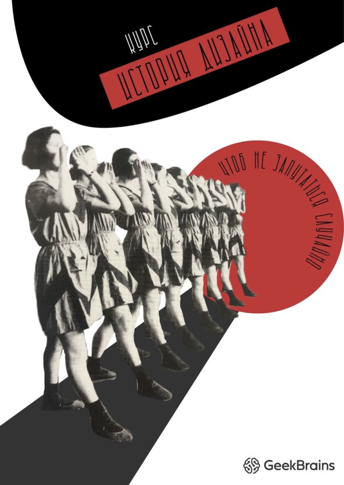
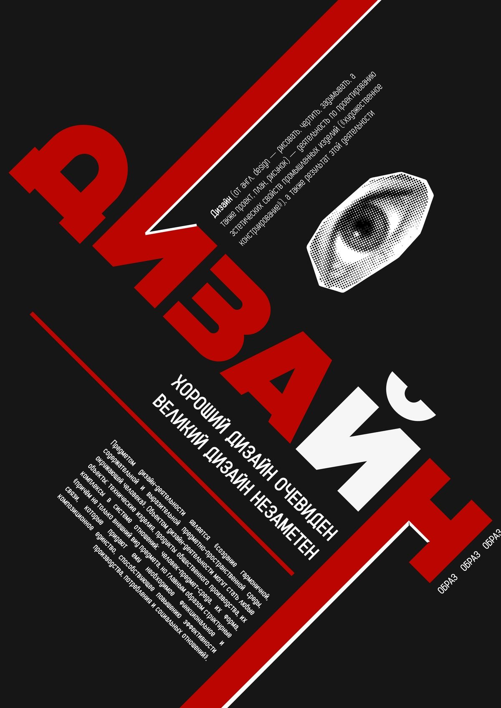
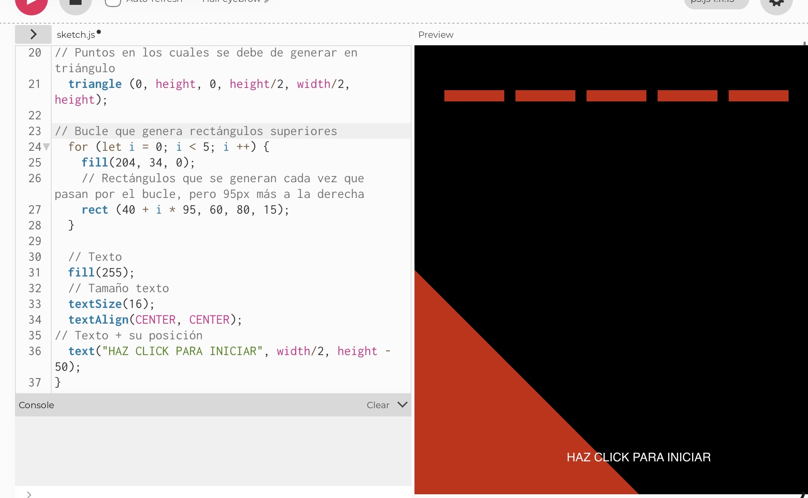
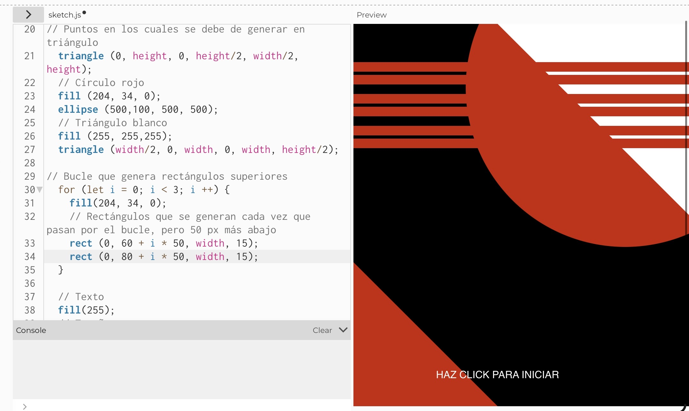
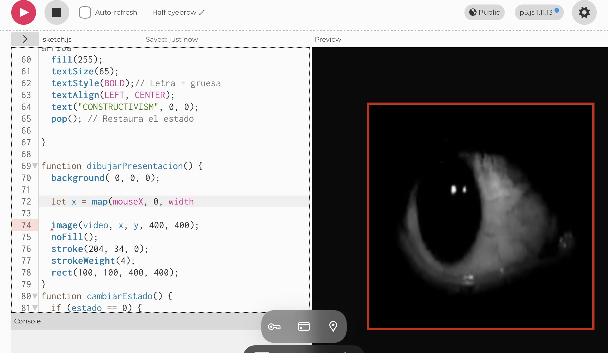
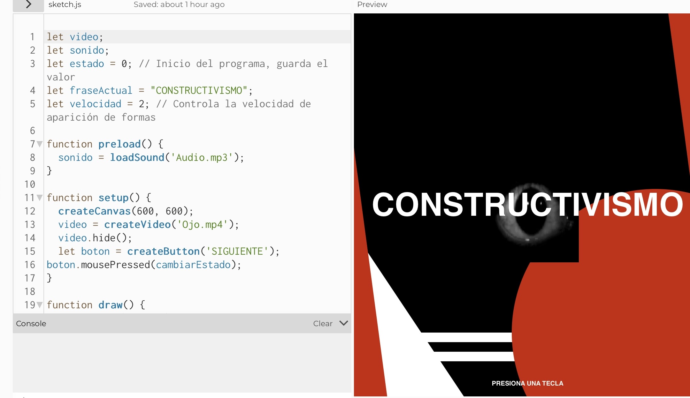
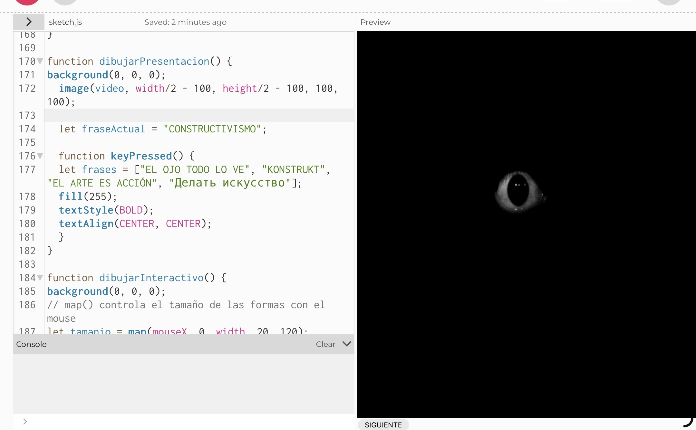
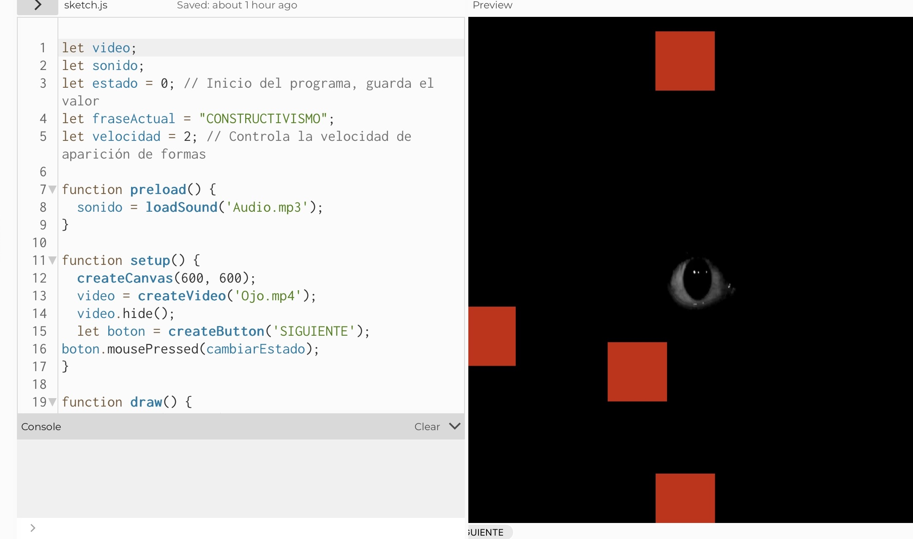
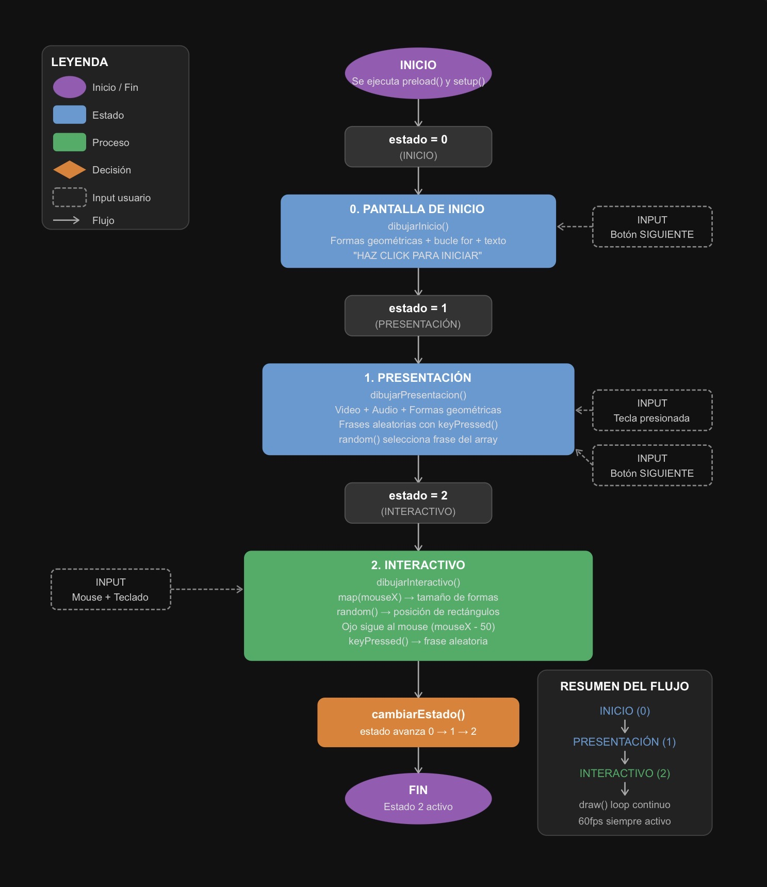

# Constructivismo
## Catalina Toledo 

## ¿Qué es este proyecto?
Mi proyecto se basa en una pieza de arte generativo interactivo desarrollada en p5.js, inspirada en la estética del Contructivismo Ruso. El programa funciona como un cartel digital que cambia; El usuario navega entre 3 estados visuales, cada uno con una intención estética y computacional distinta.

## ¿Qué es lo que muestra la pantalla?
En sus diferentes estados:

*- Estado 0:*
Composición geométrica estática con triángulos, círculos y líneas rojas sobre fondo negro. Utilización de tipografía vertical bold "CONSTRUCTIVISM".

*- Estado 1:*
Video de un ojo humano centrado en el lienzo con figuras geométricas alrededor,con audio de fondo y frases que cambian al presionar teclas aleatoriamente.

*- Estado 2:*
Rectángulos rojo de tamaño variable, aparecen en posiciones aleatorias mientras el video del ojo sigue al mouse.

## Elementos Visuales
1. Paleta de color : rojo, negro y blanco.
2. Formas geométricas simples : triángulos, rectángulos y circulos.
3. Tipografía Bold y Regular.
4. Sonido tetrico.
5. Video de un ojo en movimiento.

## Inputs utilizados
1. Click en "HAZ CLICK PARA INICIAR".
2. Movimiento del mouse.
3. Teclas del teclado aleatorias que cambian la frase.

## Outputs generados
1. Cambio de estado visual.
2. Video y audio.
3. Formas geométricas generadas dinámicamente
4. Frases aleatorias en pantalla.

# Conceptualmente
## Idea central y referente conceptual
Corriente de referencia: Constructivismo Ruso (1915 - 1930)
El constructivismo ruso fue un movimiento artístico y político que surgió en la Unión Sovietica tras la Revolución de 1917. Rechazó el arte decorativo y propuso un arte útil, funcional y accesible para las masas. Sus principales exponentes fueron *LISSITZKY*, *ALEXANDER RODCHENKO* Y *VARVARA STEPANOVA*.

## Referentes visuales, históricos o teóricos
Los carteles constructivistas se caracterizaban por el uso de formas geométricas puras (triángulos, círculos, rectángulos), el uso reducido de colores (rojo, blanco y negro), tipografías bold como elemento compositivo y diagonales que generan tensión visual. En este proyecto, esos principios se traducen computacionalmente, los bucles generan formas, las funciones organizan los estados y map() conecta la interacción humana con la composición visual.

**Referentes**

## Principio de diseño explorado
Tensión visual y geometría activa
La composición no es estática sino que responde al usuario, convirtiendo el cartel constructivista en una experiencia dinámica donde el expectador se convierte en parte de la obra.

## Sistema computacional
1. Inputs: Mouse (posición), teclado (teclas aleatorias), Click para cambiar evento.
2. Procesos: Map() traduce mouse a posición del video, random() genera posiciones y frases aleatorias, for genera formas.
3. Estados: 0 (inicio), 1 (presentación), 2 (interactivo).
4. Eventos: CambiarEstado(), KeyPressed().
5. Outputs: Formas geométricas, video, audio, frases,movimiento.

## Explicación de la interacción
*¿Qué datos entran?*
La posición del mouse (mouseX, mouseY), las teclas presionadas y el click para cambiar eventos.

*¿Cómo se procesan?*
**map()** convierte mouseX e mouseY en coordenadas de pantalla. **random()** selecciona posiciones y frases. La variable **estado** decide qué función se ejecuta.

*¿Cómo se transforman?*
El movimiento del mouse mueve el video en pantalla, cada tecla presionada genera una frase nueva, el botón avanza entre los 3 estados.

*¿Qué respuesta genera?*
Genera un cambio visual inmediato: el ojo se mueve, las formas aparecen, las frases cambian y el audio responde.

## Recursos multimedia utilizados
1. Video: Elemento visual central, el ojo se reproduce constantemente y en el evento 2 sigue al mouse.
2. Audio: Sonido ambiente que acompaña los estados 1 y 2.
Ambos elementos son funcionales, no decorativos: el video es parte activa de la composición y el audio refuerza la experiencia sensorial.

## Registro visual
referentes
Bocetos
Iteraciones
Capturas del proceso

## Reflexión 
Decidí usar un sistema de 3 estados para estructurar la experiencia, donde cada estado tiene una intención visual distinta: contemplar, escuchar y interactuar. La paleta se redujo a rojo, negro y blanco para mantener fidelidad al referente constructivista. El video del ojo fue elegido como elemento central porque conecta la idea del *observador* con la obra misma, **El ojo que mira también es mirado**.

*Dificultades encontras*
La principal dificultad fue integrar el video y el audio de forma funcional en el navegador, ya que al estar realizandolo en el ipad, Safari bloquea la reproducción autómatica de multimedia. La solución fue implementar un botón externo provisorio para activar el cambio de estado. También fue desafiante entender cómo map() traduce coordenadas del mouse en posiciones de pantalla sin que el movimiento se sintiera brusco.

*Aprendizajes obtenidos*
Comprendí que el pensamiento computacional no es solo lógica, es una forma de tomar decisiones de diseño. Cada función, cada bucle y cada variable tiene una razón estética detrás. El uso de map() y random() me demostró que con herramientas simples se puede generar complejidad visual. 
El mayor aprendizaje fue entender que un sistema de estados es una forma de narrar, el programa cuenta una historia a través de sus transiciones.

## Capturas del proyecto
**Estado 0**

**Estado 1**

**Estado 2**

## Diagrama de flujo

